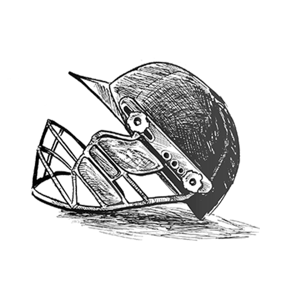
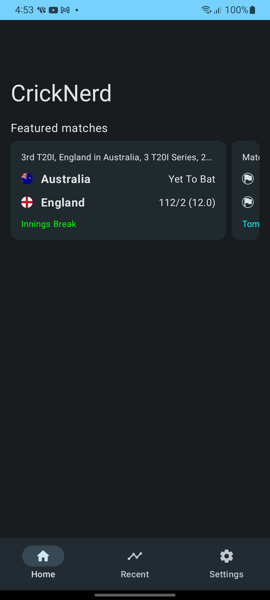
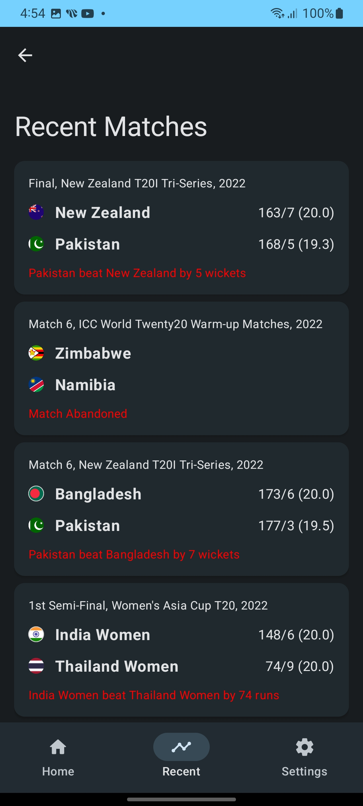
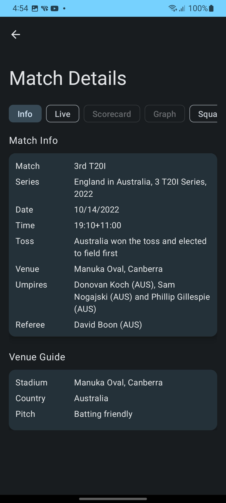
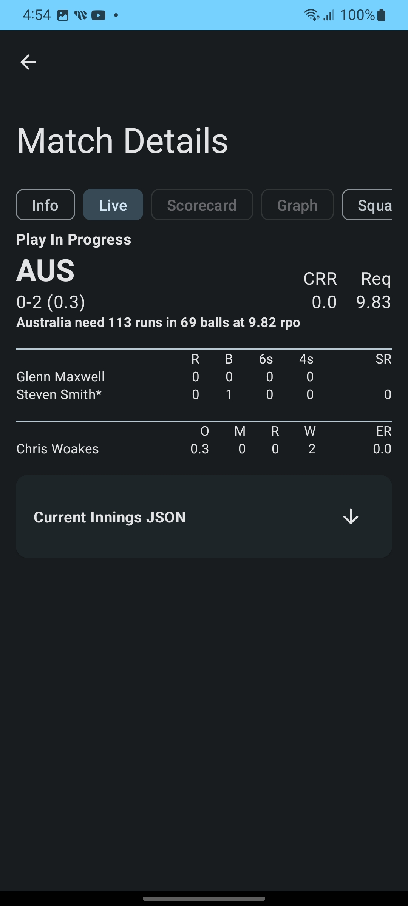
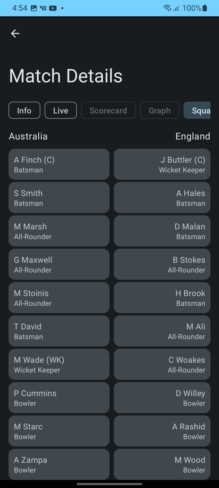

    

<h1 align="center">CricNerd</h1>

	Live Cricket scores, Ad-free

## About this project
This project is made to be an ad-free version of `CricBuzz.com` with `Material UI` to help the `CricNerd`s to enjoy the actual game, not the ads (because, who does?)

I also aim to add funcionalities which are not present in the `CricBuzz` itself (as `Picuture-In-Picture` mode).

So, stay tuned!!

> ['Help making the app better.'](#help_section)

## Screenshots

 

## Features
- Almost live scores (as fast as [ndtv](https://sports.ndtv.com/cricket))

- Easy to use and user-friendly.

- [Material Design 3](https://m3.material.io/) style clean and modern UI, with [dynamic color](https://m3.material.io/foundations/customization) theme.

- MAD: UI and logic written with pure Kotlin. Single activity, no fragments, only composable destinations.

## Help need :sweat: <a name="help_section"/>

I'm a develper by passion. I'm not so good at UI/UX and graphic designing.
I need help to
1. Make the UI/UX more pleasant.
2. Change the app logo as it is copied for an online poster.
3. Update overall appearance of this app.

> __Note__ : The app is not complete yet. Some screens (Overs, Scorecard, Graphs) are not availabel yet. But the screens shown in the screenshots work fine. I've found some scpapers for cricbuzz running on `Heroku`. But those would be slow for greater number of audinece. So, I am thinking of working with a real API or scraping sites locally with `JSoup`. I've not found any convinient API or Local Scraper to fetch live scores with. I'm fetching live data from [NDTV](https://sports.ndtv.com/cricket) api and scraping some data from [NDTV](https://sports.ndtv.com/cricket). But as it seems, it's not enough to work fluently. The commentry data is not so good. Getting player images is complecated (would need to parse full html with different api-call and get the image urls).

Please feel free to DM me at [Telegram](https://t.me/arijit_paul).
